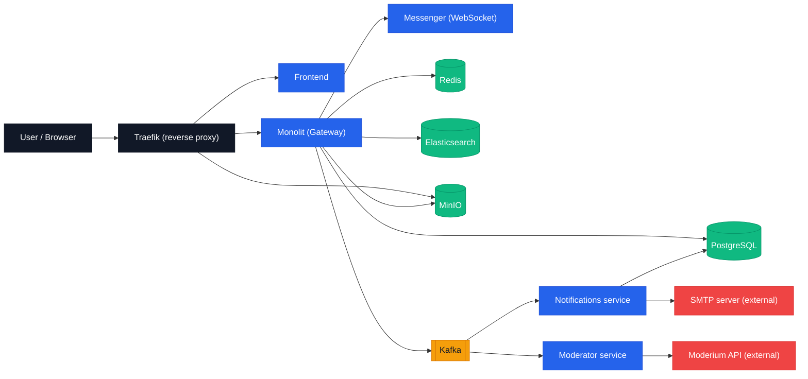

# Pitomets

Маркетплейс для питомцев: объявления, поиск, избранное, отзывы и real‑time чат.

- Frontend: React + Vite (`/frontend`)
- Основной backend: Spring Boot (Kotlin) (`/monolit`)
- Messenger: Ktor + WebSocket (`/messenger`)
- Модерация: Kafka consumer + внешнее API (`/moderator`)
- Уведомления: email/шаблоны + Kafka (`/notifications`)
- Инфраструктура: PostgreSQL, Redis, Kafka, Elasticsearch, MinIO, Prometheus/Grafana, Loki/Vector, Traefik

## Архитектура (в общих чертах)



## Быстрый старт (Dev)

1) Создать внешнюю сеть (один раз):
```bash
docker network create web
```

2) Поднять инфраструктуру + сервисы:
```bash
docker compose -f docker-compose.base.yml -f docker-compose.dev.yml up --build
```

Открыть:
- Frontend: `http://localhost:3001`
- Monolit API: `http://localhost:8080`
- Messenger: `http://localhost:8081` (WS на `/ws/chat`, см. `messenger/README.md`)
- Grafana: `http://localhost:3000` (admin/admin)
- Prometheus: `http://localhost:9090`
- MinIO console: `http://localhost:9001` (minioadmin/minioadmin)
- Mailhog: `http://localhost:8025`

## Production (Docker + Traefik)

- Traefik поднимается отдельно: `traefik/docker-compose.yml` (требует ту же внешнюю сеть `web`).
- Образы/переменные по умолчанию лежат в `.env`, а дополнительные prod‑настройки — в `.env.prod`.

Запуск:
```bash
docker network create web
docker compose -f traefik/docker-compose.yml up -d
docker compose -f docker-compose.base.yml -f docker-compose.prod.yml up -d
```

Маршруты в `docker-compose.prod.yml` настроены так:
- `https://<host>/api/*` → monolit (контейнер `monolit`, порт 8080)
- `https://<host>/ws/*` → messenger (порт 8081)
- `https://<host>/media/*` → MinIO (порт 9000)
- Остальное → frontend (порт 80)

## Сервисы и порты (локально)

| Компонент | Порт(ы) | Назначение |
|---|---:|---|
| Frontend | 3001 | UI (dev‑сервер) |
| Monolit | 8080 | API (Spring Boot) |
| Messenger | 8081 | API/WS (Ktor) |
| Notifications | 8082 | Email‑уведомления (dev) |
| PostgreSQL | 5432 | Основная БД (`pitomets`) |
| PostgreSQL (messenger) | 5433 | БД чатов (`messenger`) |
| Redis | 6379 | Кеш/сессии |
| Elasticsearch | 9200 | Поиск |
| Kafka | 9092, 29092 | События/очереди |
| MinIO | 9000, 9001 | S3‑совместимое хранилище |
| Prometheus | 9090 | Метрики |
| Grafana | 3000 | Дашборды |
| Loki | 3100 | Логи |
| cAdvisor | 4040 | Метрики контейнеров |

## Полезные ссылки по модулям

- `frontend/README.md` — возможности UI и конфигурация `VITE_API_BASE_URL`
- `messenger/README.md` — API/WS и требования к `X-User-Id`
- `moderator/README.md` — форматы событий Kafka и переменные окружения
- `monolit/README.md` — локальные заметки по сборке/инфре

---

<details>
<summary>Legacy: старый README (технические заметки)</summary>

````md
# pitomets
this is description

Предварительная настройка (создание сети)
```
docker network create web
```

Можно пробить туннель до контейнеров
```
ssh -i ~/.ssh/1244 -L 5432:localhost:5432 student@178.154.194.186
```

дев сборка
```
docker compose -f docker-compose.base.yml -f docker-compose.dev.yml down && docker compose -f docker-compose.base.yml -f docker-compose.dev.yml up --build
```
прод сборка
```
docker compose -f docker-compose.base.yml -f docker-compose.prod.yml down && docker compose -f docker-compose.base.yml -f docker-compose.prod.yml pull && docker compose -f docker-compose.base.yml -f docker-compose.prod.yml up --build
```

Сборка образа
```
docker buildx build \
--platform linux/amd64 \
-t artshar/frontend:1.0.0 \
--push .
```

Дропнуть всё
```
docker stop $(docker ps -aq) 2>/dev/null && docker rm $(docker ps -aq) 2>/dev/null && docker volume rm $(docker volume ls -q) 2>/dev/null
```

Дашборды графаны

1860
763
9628

a
локи логи {container=~".+"}
````

</details>
